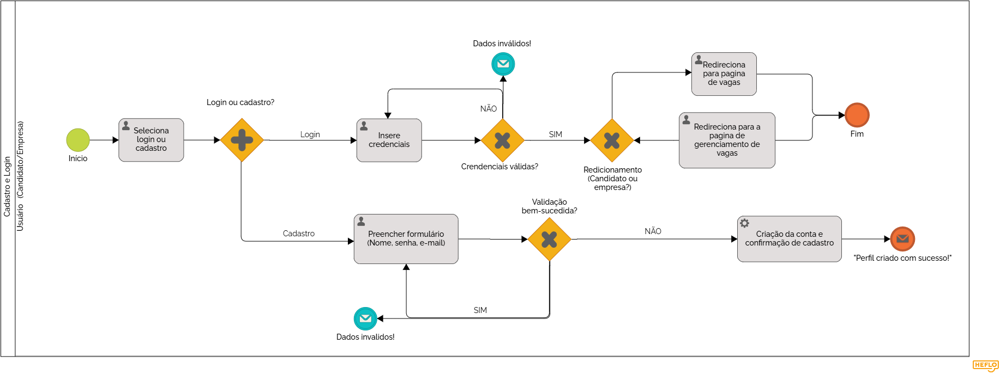

### 3.3.1 Processo 1 – CADASTRO E LOGIN

_O processo inicia quando o usuário seleciona entre login ou cadastro. Se optar por login, insere suas credenciais, que são validadas pelo sistema. Caso inválidas, o sistema retorna um erro e solicita correção. Se válidas, o usuário é redirecionado conforme seu perfil (candidato ou empresa). Para cadastro, o usuário preenche um formulário e aguarda validação. Se houver erro, é notificado; se bem-sucedido, a conta é criada e confirmada, encerrando o processo._

#### Detalhamento das atividades

##### Seleciona login ou cadastro

| **Campo**       | **Tipo**         | **Restrições** | **Valor default** |
|-----------------|-----------------|---------------|-------------------|
| Escolha        | Seleção única    | Login/Cadastro | - |

| **Comandos**   | **Destino**        | **Tipo**  |
|---------------|------------------|----------|
| Próximo      | Insere credenciais / Preencher formulário | Default |

##### Insere credenciais

| **Campo** | **Tipo**       | **Restrições**         | **Valor default** |
|----------|---------------|-----------------------|-------------------|
| E-mail   | Caixa de texto | Formato de e-mail      | - |
| Senha    | Caixa de texto | Mínimo de 8 caracteres | - |

| **Comandos**   | **Destino**          | **Tipo**  |
|---------------|------------------|----------|
| Entrar       | Validação de credenciais | Default |

##### Validação de credenciais

| **Campo**        | **Tipo**     | **Restrições**  | **Valor default** |
|-----------------|-------------|---------------|-------------------|
| Status         | Seleção única | Válido/Inválido | - |

| **Comandos**   | **Destino**                         | **Tipo**  |
|---------------|---------------------------------|----------|
| Redirecionar | Página de vagas / Gerenciamento de vagas | Default |
| Tentar novamente | Insere credenciais | Cancel |

##### Preencher formulário

| **Campo**      | **Tipo**       | **Restrições**         | **Valor default** |
|---------------|---------------|-----------------------|-------------------|
| Nome         | Caixa de texto | Obrigatório           | - |
| E-mail       | Caixa de texto | Formato de e-mail     | - |
| Senha        | Caixa de texto | Mínimo de 8 caracteres | - |

| **Comandos**    | **Destino**                 | **Tipo**  |
|----------------|---------------------------|----------|
| Enviar        | Validação de cadastro       | Default |

##### Validação de cadastro

| **Campo**        | **Tipo**     | **Restrições**  | **Valor default** |
|-----------------|-------------|---------------|-------------------|
| Status         | Seleção única | Válido/Inválido | - |

| **Comandos**       | **Destino**                    | **Tipo**  |
|------------------|--------------------------------|----------|
| Criar conta     | Confirmação de cadastro         | Default |
| Tentar novamente | Preencher formulário           | Cancel |

##### Confirmação de cadastro

| **Campo**       | **Tipo**     | **Restrições** | **Valor default** |
|----------------|-------------|--------------|-------------------|
| Mensagem      | Texto        | -            | "Perfil criado com sucesso!" |

| **Comandos**   | **Destino** | **Tipo**  |
|---------------|-------------|----------|
| Finalizar    | Fim do processo | Default |
